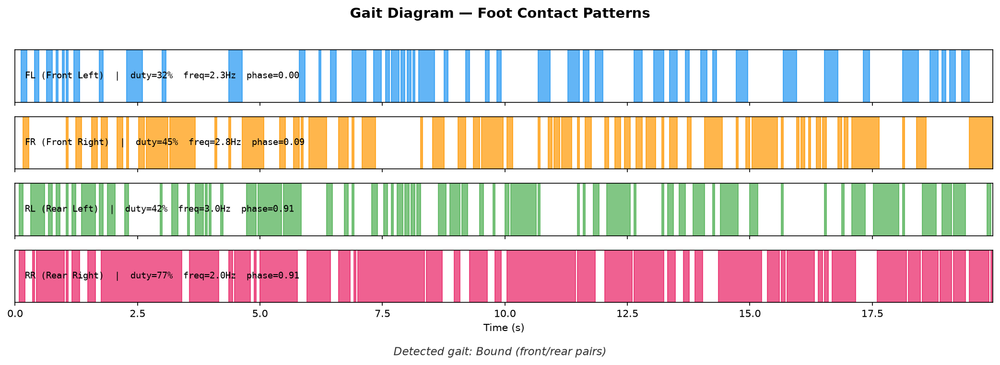
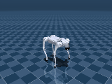

<div align="center">

# RL-Based Quadruped Locomotion

**Training a Unitree Go2 quadruped to walk using reinforcement learning in MuJoCo**


[](https://www.python.org/)
[](https://mujoco.org/)
[](https://github.com/DLR-RM/stable-baselines3)
[](LICENSE)

*A 12-DoF quadruped learns forward locomotion from scratch via PPO, achieving 0.74 m/s in simulation*

</div>

---

## Highlights

- **Custom Gymnasium environment** with an 8-term reward function for natural gait emergence
- **PD position controller** on top of torque actuators — matching the industry-standard sim-to-real pipeline (IsaacGym, legged_gym, ETH ANYmal)
- **Curriculum learning** that ramps velocity targets from 0.3 to 0.8 m/s
- **Algorithm comparison** across PPO, SAC, and TD3 with analysis of why PPO dominates for locomotion
- **5 iterative training runs** documented with failure analysis — not just final results

## Results

<table>
<tr>
<td>

**Evaluation over 50 episodes (5M steps PPO)**

| Metric | Value |
|:---|:---|
| Mean forward speed | **0.737 m/s** |
| Target speed | 0.800 m/s |
| Peak episode speed | 0.874 m/s |
| Mean episode length | 277 steps (11.1s) |
| Control frequency | 25 Hz |
| Training time | 1h 50m (8 parallel envs) |

</td>
<td>

**Algorithm comparison (1M steps each)**

| Metric | PPO | SAC | TD3 |
|:---|:---|:---|:---|
| Forward speed | **0.14 m/s** | 0.03 m/s | 0.01 m/s |
| Ep. length | 264 | 244 | **440** |
| Survival | 0% | 0% | **10%** |
| Behavior | Walks | Stands | Stands |

</td>
</tr>
</table>

> **Why PPO wins:** On-policy rollouts (2048 steps x 8 envs = 16k samples per update) provide the exploration needed to discover walking gaits. Off-policy methods (SAC, TD3) fill their replay buffers with early falling experiences, converging to stable-but-stationary policies.

---

## Architecture

The policy outputs joint position targets, not raw torques. A PD controller converts these to torques — this is the same architecture used for real-world deployment on physical quadrupeds.

```
                    ┌─────────────────────────────────────────────┐
                    │              RL Control Loop                │
                    │                                             │
 ┌──────────┐      │  ┌────────────┐     ┌──────────────────┐    │
 │ Command  │──────┼─▶│            │     │                  │    │
 │ Velocity │      │  │ Observation│────▶│   MLP [256,256]  │    │
 │ (vx,vy,w)│      │  │  (53-dim)  │     │      (PPO)       │    │
 └──────────┘      │  │            │     │                  │    │
                    │  └────────────┘     └────────┬─────────┘    │
 ┌──────────┐      │        ▲                     │              │
 │  MuJoCo  │──────┼────────┘                     ▼              │
 │ Physics  │      │                     ┌──────────────────┐    │
 │          │◀─────┼─────────────────────│  PD Controller   │    │
 │ 500 Hz   │      │     torques         │ τ = Kp(q*-q)-Kd·q̇│    │
 └──────────┘      │                     │  Kp=40  Kd=1     │    │
                    │                     └──────────────────┘    │
                    └─────────────────────────────────────────────┘
                              Control at 25 Hz (frame_skip=20)
```

### Observation Space (53 dimensions)

| Component | Dims | Description |
|:---|:---:|:---|
| Base orientation | 4 | Quaternion from `qpos[3:7]` |
| Base angular velocity | 3 | Roll, pitch, yaw rates |
| Base linear velocity | 3 | Forward, lateral, vertical speed |
| Joint positions | 12 | 4 legs x 3 joints (hip, thigh, calf) |
| Joint velocities | 12 | Angular velocity of each joint |
| Previous actions | 12 | Last commanded position targets |
| Foot contacts | 4 | Binary ground contact per foot |
| Command velocity | 3 | Target (vx, vy, yaw_rate) |

> **Design choice:** Absolute x/y position is excluded so the policy is position-invariant — it behaves the same whether the robot is at the origin or 100m away.

### Action Space (12 dimensions)

Each action is a position offset from the default standing pose:

```
target_position = default_standing_pose + action * 0.5 rad
torque = Kp * (target - current_pos) - Kd * current_vel
```

Actions are normalized to [-1, 1]. The 0.5 rad scale allows ~28 degrees of joint movement per step.

### Reward Function

The reward balances velocity tracking against stability and efficiency:

```python
reward = (
    # --- Drive forward ---
    + 2.0 * exp(-vel_error² / 0.25)     # Track commanded velocity
    + 0.5 * exp(-yaw_error² / 0.25)     # Track commanded yaw rate
    + 0.5                                # Alive bonus (survival)
    # --- Stay stable ---
    - 0.5 * |lateral_vel|               # Don't crab-walk
    - 1.0 * orientation_error²          # Stay upright (projected gravity)
    # --- Move efficiently ---
    - 0.01 * |action_change|²           # Smooth motions
    - 0.0001 * |torques|²              # Energy efficiency
    # --- Walk naturally ---
    + 0.1 * gait_regularity             # Encourage diagonal trot
)
```

The velocity tracking term uses an exponential kernel: the agent gets near-zero reward when stationary, and full reward when matching the commanded speed. The alive bonus is kept deliberately small (0.5) so it doesn't dominate — this was a key lesson from failed early runs.

---

## Training Progression

Getting a quadruped to walk is not plug-and-play. This section documents the iteration process, including failures:

| Run | Steps | What Changed | Forward Speed | What Happened |
|:---:|:---:|:---|:---:|:---|
| 1 | 2M | Baseline reward | 0.00 m/s | Robot stands still — alive bonus (0.5/step) is more rewarding than attempting to walk |
| 2 | 2M | Increased velocity weight, reduced alive bonus | 0.00 m/s | Exponential reward is too flat — standing vs slow walking both score ~0.1 |
| 3 | 2M | Switched to linear velocity reward | 0.00 m/s | Robot falls immediately — sending position values to torque actuators produces near-zero force |
| 4 | 2M | **Added PD controller** | **0.25 m/s** | First successful locomotion! PD converts position targets to proper torques |
| 5 | 5M | Slower curriculum (1M warmup), more training | **0.74 m/s** | Stable walking gait at 92% of target speed |

### Key Insights

1. **Actuator type matters.** The Go2 MJCF defines torque actuators (±23.7 Nm). The RL policy should output position targets, not raw torques — a PD controller bridges the gap. This is standard in every serious quadruped RL framework.

2. **Reward shaping is iterative.** The alive bonus must be small enough that the agent is incentivized to move, but large enough that it doesn't learn to run and crash. Three of five runs failed due to reward imbalance.

3. **Curriculum learning is critical.** Starting with a low velocity target (0.3 m/s) lets the policy learn balance before attempting fast locomotion. Without curriculum, the agent either learns to stand (safe) or fall (fast).

---

## Getting Started

### Prerequisites

- Python 3.10+
- MuJoCo 3.0+
- CUDA GPU (optional, PPO trains well on CPU)

### Installation

```bash
git clone https://github.com/N1CKX-MU/quadruped-rl-locomotion.git
cd quadruped-rl-locomotion

# Creates venv, installs dependencies, downloads Go2 model
make setup

# Verify everything works
make verify
```

### Quick Start

```bash
# Train a policy (5M steps, ~2 hours with 8 parallel envs)
make train

# Monitor training in real time
make tensorboard

# Evaluate the trained policy (50 episodes, prints metrics table)
make evaluate

# Watch the robot walk in the MuJoCo viewer
make evaluate-render

# Record a demo video
make record

# Compare PPO vs SAC vs TD3
make compare
```

### Configuration

All hyperparameters are in `configs/training_config.yaml`:

```yaml
environment:
  cmd_vel: [0.5, 0.0, 0.0]       # Target velocity [vx, vy, yaw_rate]
  action_scale: 0.5               # Joint position range (rad)
  frame_skip: 20                  # 25 Hz control

training:
  total_timesteps: 5_000_000
  n_envs: 8
  learning_rate: 3.0e-4
  n_steps: 2048
  batch_size: 64
  policy_kwargs:
    net_arch: [256, 256]

curriculum:
  enabled: true
  start_vel: 0.3
  max_vel: 0.8
  warmup_steps: 1_000_000
```

---

## Hyperparameters

<details>
<summary>Full hyperparameter table</summary>

| Parameter | Value | Notes |
|:---|:---|:---|
| Algorithm | PPO | On-policy, good for locomotion |
| Policy network | MLP [256, 256] | Separate actor/critic heads |
| Learning rate | 3e-4 | Standard for continuous control |
| Rollout length | 2048 steps/env | Long rollouts help locomotion |
| Mini-batch size | 64 | 2048*8/64 = 256 updates per epoch |
| Epochs per update | 10 | Multiple passes over each rollout |
| Discount (gamma) | 0.99 | Long horizon for steady gaits |
| GAE lambda | 0.95 | Bias-variance tradeoff in advantages |
| Clip range | 0.2 | PPO's trust region constraint |
| Entropy coefficient | 0.01 | Encourages exploration |
| Value function coeff. | 0.5 | Critic loss weight |
| Max gradient norm | 0.5 | Gradient clipping |
| Parallel envs | 8 | SubprocVecEnv for throughput |
| Observation norm | VecNormalize | Running mean/std, clip at 10 |
| Reward norm | VecNormalize | Stabilizes training signal |
| PD gains (Kp, Kd) | 40, 1 | Position control stiffness/damping |
| Frame skip | 20 | 500 Hz physics / 25 Hz control |
| Action scale | 0.5 rad | ~28 deg max joint offset |

</details>

## Project Structure

```
quadruped-rl-locomotion/
├── envs/
│   ├── __init__.py                 # Gym registration (Go2Walk-v0)
│   └── go2_env.py                  # Environment: observations, reward, PD control, termination
├── callbacks/
│   ├── __init__.py
│   └── curriculum.py               # Linearly ramps target velocity during training
├── configs/
│   └── training_config.yaml        # All hyperparameters in one place
├── scripts/
│   ├── train.py                    # PPO training with SubprocVecEnv + VecNormalize
│   ├── evaluate.py                 # Run N episodes, print metrics table
│   ├── record_video.py             # Record MP4 + GIF with tracking camera
│   ├── compare_algorithms.py       # Train PPO, SAC, TD3 side by side
│   ├── plot_results.py             # Plot training curves from TensorBoard logs
│   ├── verify_model.py             # Sanity check: load env, step random actions
│   ├── gait_analysis.py            # Foot contact analysis + gait diagram
│   ├── generate_terrain.py         # Heightfield terrain generation
│   └── record_push_recovery.py     # Push recovery demo recording
├── models/                         # Trained weights (gitignored)
├── logs/                           # Evaluation results and training logs
├── assets/                         # Demo GIFs and videos
├── requirements.txt
└── Makefile                        # One-command workflows
```

## Tech Stack

| Component | Tool | Purpose |
|:---|:---|:---|
| Physics simulation | [MuJoCo 3.x](https://mujoco.org/) | Fast, accurate rigid body dynamics |
| Robot model | [MuJoCo Menagerie](https://github.com/google-deepmind/mujoco_menagerie) | Unitree Go2 MJCF |
| RL interface | [Gymnasium](https://gymnasium.farama.org/) | Standard env API |
| RL algorithms | [Stable-Baselines3](https://github.com/DLR-RM/stable-baselines3) | PPO, SAC, TD3 implementations |
| Training monitoring | [TensorBoard](https://www.tensorflow.org/tensorboard) | Loss curves, reward tracking |
| Video recording | [imageio](https://imageio.readthedocs.io/) | MP4 + GIF export |

## Advanced Analysis

### Gait Analysis

The trained policy develops an emergent **bounding gait** — front and rear leg pairs move roughly in phase (FR/RL phase offset ~0.9, RR phase offset ~0.9 relative to FL). The gait regularity reward term provides a gentle bias toward diagonal coordination, but the policy finds bounding more effective at the target speed. The rear legs show higher duty factors (especially RR at 77%), indicating the policy relies heavily on rear-leg propulsion — consistent with biological quadrupeds where hindlimbs generate most forward thrust.

```bash
# Generate gait diagram from trained policy
make gait-analysis
```



### Push Recovery

The policy shows robustness to external perturbations, recovering from lateral velocity impulses of up to 2.0 m/s. This robustness comes from the combination of domain randomization (random pushes every 200 steps during training) and the orientation penalty in the reward function.

```bash
# Record push recovery demo
make push-recovery
```



### Rough Terrain

A heightfield terrain generator creates Gaussian-smoothed random bumps for testing locomotion robustness on uneven ground.

```bash
# Generate terrain XML and heightfield
make terrain
```

---

## Sim-to-Real Considerations

This project is simulation-only, but the architecture is designed with sim-to-real transfer in mind. Here's what would be needed to deploy on a physical Unitree Go2:

### What transfers directly

| Component | Sim | Real | Transfer difficulty |
|:---|:---|:---|:---|
| PD position controller | Software PD on torque actuators | Go2 SDK accepts position targets natively | Trivial — the SDK handles PD internally |
| Policy network | MLP [256, 256], ~135K params | Runs at 25 Hz on any embedded CPU | Trivial — inference is <1ms |
| Observation space | From `qpos`/`qvel` | IMU + joint encoders provide the same signals | Moderate — sensor noise differs |
| Action space | Position offsets from default pose | Same representation, mapped to SDK joint commands | Direct mapping |

### The sim-to-real gap

The main challenges for real deployment:

1. **Actuator dynamics.** MuJoCo models the Go2's actuators as ideal torque sources with hard limits (±23.7 Nm). Real motors have delay (~5-10ms), backlash, friction, and torque curves that depend on speed. Training with domain randomization on motor strength (±10-20%) partially addresses this.

2. **Contact modeling.** MuJoCo's contact solver uses soft contacts with well-defined friction cones. Real foot-ground contact is noisy, varies with surface material, and includes deformable rubber foot pads. The foot contact binary signal is particularly unreliable on real hardware.

3. **State estimation.** In simulation, `qvel` gives exact base velocity. On hardware, this must be estimated from IMU integration (drift-prone) or a state estimator fusing IMU + leg kinematics + (optionally) visual odometry. This is often the biggest sim-to-real gap.

4. **Latency.** Sim runs with zero communication delay. Real systems have 5-20ms of sensor-to-actuator latency. Adding artificial observation delay during training (1-3 steps of random delay) is a common mitigation.

### Standard sim-to-real techniques

The following techniques from the literature would improve transfer:

- **Domain randomization** (partially implemented): Randomize friction, mass, motor strength, observation noise, and actuation delay during training so the policy learns to be robust to parameter uncertainty.
- **Asymmetric actor-critic**: Give the critic access to privileged simulation state (exact contacts, terrain height) while the actor only sees realistic observations. This improves training efficiency without affecting deployment.
- **Teacher-student distillation**: Train a teacher policy with privileged info, then distill into a student that uses only deployable observations.
- **Action filtering**: Apply a low-pass filter to actions before sending to motors, reducing high-frequency jitter that real actuators can't track.

> **Reference implementations:** [legged_gym](https://github.com/leggedrobotics/legged_gym) (ETH Zurich) and [walk-these-ways](https://github.com/Improbable-AI/walk-these-ways) (MIT) demonstrate full sim-to-real pipelines for quadruped locomotion using these techniques.

---

## References

- Rudin et al., [Learning to Walk in Minutes Using Massively Parallel Deep RL](https://arxiv.org/abs/2109.11978), CoRL 2022
- Schulman et al., [Proximal Policy Optimization Algorithms](https://arxiv.org/abs/1707.06347), 2017
- Hwangbo et al., [Learning Agile and Dynamic Motor Skills for Legged Robots](https://arxiv.org/abs/1901.08652), Science Robotics 2019
- [MuJoCo Menagerie — Unitree Go2](https://github.com/google-deepmind/mujoco_menagerie/tree/main/unitree_go2)
- [Stable-Baselines3 Documentation](https://stable-baselines3.readthedocs.io/)

---

<div align="center">

Built with MuJoCo, Gymnasium, and Stable-Baselines3

</div>
