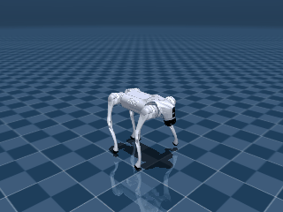

# RL-Based Quadruped Locomotion

Training a Unitree Go2 quadruped robot to walk in MuJoCo simulation using Proximal Policy Optimization (PPO).



## Overview

This project trains a neural network policy to control a 12-DoF quadruped robot for forward locomotion. The policy outputs joint position targets at 25 Hz, which are converted to torques via a PD controller — matching the standard sim-to-real pipeline used in industry (IsaacGym, legged_gym, ETH ANYmal).

**Key results after 5M timesteps of training:**

| Metric | Value |
|---|---|
| Mean forward speed | 0.737 m/s |
| Target speed | 0.800 m/s |
| Best episode speed | 0.874 m/s |
| Mean episode length | 277 steps (11s) |
| Control frequency | 25 Hz |

## Architecture

```
Command Velocity ─┐
                   ├──→ [Observation 53-dim] ──→ [MLP 256x256] ──→ [Action 12-dim]
Robot State ───────┘          │                     (PPO)              │
                              │                                        │
                              │         ┌──────────────────────────────┘
                              │         │  Joint position targets
                              │         ▼
                              │    [PD Controller]  torque = Kp(q_target - q) - Kd * dq
                              │         │
                              │         ▼
                              └──── [MuJoCo Physics] ──→ next state
```

### Observation Space (53 dimensions)

| Component | Dims | Source |
|---|---|---|
| Base orientation (quaternion) | 4 | `qpos[3:7]` |
| Base angular velocity | 3 | `qvel[3:6]` |
| Base linear velocity | 3 | `qvel[0:3]` |
| Joint positions | 12 | `qpos[7:19]` |
| Joint velocities | 12 | `qvel[6:18]` |
| Previous actions | 12 | Action buffer |
| Foot contacts (binary) | 4 | Contact detection |
| Command velocity (vx, vy, yaw) | 3 | Curriculum target |

Absolute x/y position is excluded so the policy generalizes across the workspace.

### Action Space (12 dimensions)

Joint position offsets from the default standing pose, normalized to [-1, 1] and scaled by 0.5 rad. A PD controller (Kp=40, Kd=1) converts these targets to torques, clipped to actuator limits.

### Reward Function (8 terms)

| Term | Weight | Purpose |
|---|---|---|
| Linear velocity tracking | 2.0 | Track commanded forward speed (exp kernel) |
| Angular velocity tracking | 0.5 | Track commanded yaw rate |
| Alive bonus | 0.5 | Survival incentive |
| Lateral velocity penalty | -0.5 | Prevent crab-walking |
| Orientation penalty | -1.0 | Stay upright (projected gravity) |
| Action rate penalty | -0.01 | Smooth joint motions |
| Joint torque penalty | -0.0001 | Energy efficiency |
| Gait regularity | 0.1 | Encourage diagonal trot pattern |

### Curriculum Learning

Target velocity ramps linearly from 0.3 m/s to 0.8 m/s over the first 1M timesteps, allowing the policy to first learn balance before attempting fast locomotion.

## Training Progression

The reward function required several iterations to produce forward locomotion:

| Run | Steps | Change | Result |
|---|---|---|---|
| 1 | 2M | Baseline (exp reward, alive=0.5) | Stands still (0 m/s) — alive bonus dominates |
| 2 | 2M | Reduced alive, increased vel weight | Still stands (0 m/s) — exp too flat |
| 3 | 2M | Linear velocity reward | Falls immediately — wrong actuator model |
| 4 | 2M | Added PD controller | Walks at 0.25 m/s — first locomotion |
| 5 | 5M | Slower curriculum, more steps | **Walks at 0.74 m/s** |

Key insight: the Go2 MJCF uses torque actuators (±23.7 Nm). Sending position targets directly produces near-zero torque. The PD controller layer was essential.

## Installation

```bash
# Clone the repo
git clone https://github.com/N1CKX-MU/quadruped-rl-locomotion.git
cd quadruped-rl-locomotion

# Setup (creates venv, installs deps, clones MuJoCo Menagerie)
make setup

# Verify the environment loads
make verify
```

### Requirements

- Python 3.10+
- MuJoCo 3.0+
- CUDA (optional, for GPU training)

## Usage

### Train

```bash
# Full training run (5M steps, ~2 hours on 8 parallel envs)
make train

# Monitor training curves
make tensorboard
```

### Evaluate

```bash
# Run 50 episodes and print metrics
make evaluate

# Watch the policy in the MuJoCo viewer
make evaluate-render
```

### Record Videos

```bash
make record
```

### Compare Algorithms

```bash
# Train PPO, SAC, and TD3 side by side
make compare

# Plot training curves
make plot
```

## Hyperparameters

| Parameter | Value |
|---|---|
| Algorithm | PPO |
| Network | MLP [256, 256] |
| Learning rate | 3e-4 |
| Rollout steps | 2048 per env |
| Batch size | 64 |
| Epochs per update | 10 |
| Discount (gamma) | 0.99 |
| GAE lambda | 0.95 |
| Clip range | 0.2 |
| Entropy coefficient | 0.01 |
| Parallel envs | 8 |
| PD gains (Kp, Kd) | 40, 1 |
| Frame skip | 20 (25 Hz control) |

## Project Structure

```
quadruped-rl-locomotion/
├── envs/
│   ├── __init__.py              # Gym registration (Go2Walk-v0)
│   └── go2_env.py               # Custom env: obs, reward, PD control
├── callbacks/
│   ├── __init__.py
│   └── curriculum.py            # Velocity curriculum callback
├── configs/
│   └── training_config.yaml     # All hyperparameters
├── scripts/
│   ├── train.py                 # PPO training with SubprocVecEnv
│   ├── evaluate.py              # Metrics over N episodes
│   ├── record_video.py          # MP4 + GIF recording
│   ├── compare_algorithms.py    # PPO vs SAC vs TD3
│   ├── plot_results.py          # Training curve plots
│   └── verify_model.py          # Environment sanity check
├── models/                      # Saved checkpoints
├── logs/                        # Eval results + TensorBoard
├── assets/                      # Demo videos/GIFs
├── requirements.txt
└── Makefile
```

## References

- [Stable-Baselines3](https://github.com/DLR-RM/stable-baselines3)
- [MuJoCo Menagerie — Unitree Go2](https://github.com/google-deepmind/mujoco_menagerie)
- [Learning to Walk in Minutes Using Massively Parallel Deep RL (Rudin et al., 2022)](https://arxiv.org/abs/2109.11978)
- [Proximal Policy Optimization (Schulman et al., 2017)](https://arxiv.org/abs/1707.06347)
